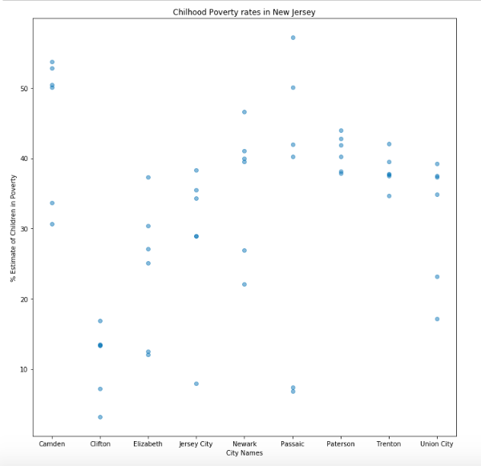

## Assignment 1: Plot a visualization

For this plot I used the City Health Dashboard, developed by NYU School of Medicine. I looked at childhood poverty rates in New Jersey
(my current homestate).

**Figure 1:** The above plot shows the percentage of children in poverty for each recorded city in New Jersey. Each dot represents a unique census tract.  

## Assignment 2: Citi Bike Analysis (Null Hypothesis Testing)

I completed the analysis for the Citi Bike data retrieved and graphed in HW 4.
You can find a full report of my findings [here](https://www.authorea.com/336213/T2wPh_oVnG2sr-ql91r7Fg).
